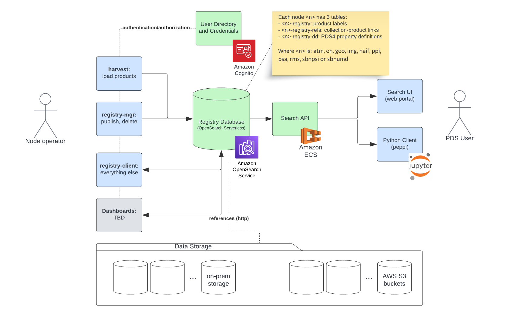

==================
About PDS Registry
==================

The PDS Registry Service
*************************

PDS Registry Service enables tracking, searching, auditing, locating, and maintaining artifacts within the system.
These artifacts can range from data files and label files, schemas, dictionary definitions for objects and elements, services, etc...

The PDS Registry Service is enabled by a complex architecture of components deployed on the AWS Cloud by Engineering Node and on premises by the PDS Discipline Nodes.

The high level architecture of the PDS Registry Service is shown below:

The PDS Registry Application is the software which implements the components of the PDS Registry Service.

The PDS Registry Application
*****************************

The core functionality for the PDS Registry Application is satisfied by `OpenSearch <https://opensearch.org/>`_.

API
----

Provides read-only REST APIs to search and access PDS data. You can call REST APIs directly or
use Python or Java clients.

The most popular client library is `peppi <https://nasa-pds.github.io/peppi>`_.

For direct access, the API is documented `here <https://nasa-pds.github.io/pds-api/guides/search.html>`_.

OpenSearch
-----------

`OpenSearch <https://opensearch.org/>`_ is a NoSQL database based on Apache Lucene project,
optimized for text search. All metadata extracted from PDS4 labels is stored in the OpenSearch database provided by AWS as `OpenSearch Serverless Managed Service <https://docs.aws.amazon.com/opensearch-service/latest/developerguide/serverless.html>`_.

Authentication/Authorization
-----------------------------

The access to the OpenSearch service is restricted using Cognito username and passwords provided by Engineering Node to the other PDS nodes.
Using their login, discipline node can write in their own OpenSearch indexes and read from all the other indexes.

Harvest
--------

Harvest is a software to crawl and extract metadata from PDS4 labels and to load
extracted information into OpenSearch.

This command-line tool doesn't require complex installation and configuration.

Registry Manager
-----------------

A command-line tool to perform admin tasks on a Registry, such as:

 * Update product archive status.
 * Delete products.
 * Create or delete registry indices in OpenSearch (by Engineering Node administrators).
 * Manage registry data dictionary (by Engineering Node administrators).

Registry Client
----------------

A command-line tool which provides full access to the OpenSearch API to handle operations not supported by the previous tools.
The application takes care of the authentication of the user and signs the queries as required by the AWS OpenSearch Serverless Managed Service.
