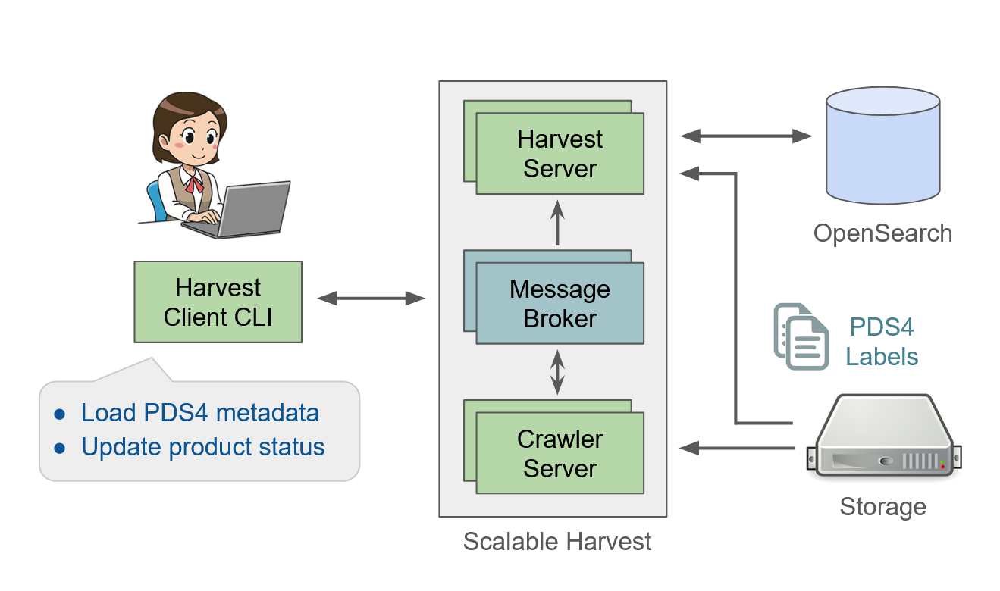

==================
About PDS Registry
==================

The PDS Registry Service
*************************

PDS Registry Service enables tracking, searching, auditing, locating, and maintaining artifacts within the system.
These artifacts can range from data files and label files, schemas, dictionary definitions for objects and elements, services, etc...

The PDS Registry Service is enabled by a complex architecture of components deployed on the AWS Cloud by Engineering Node and on premises by the PDS Discipline Nodes.

The high level architecture of the PDS Registry Service is shown below:

.. image:: _static/images/registry_service.png

Details on the deployment on AWS are given in the :doc:`cloud architecture page</cloud/architecture>`.

The PDS Registry Application is the software which implements the components of the PDS Registry Service.

The PDS Registry Application
*****************************

The core functionality for the PDS Registry Application is satisfied by `OpenSearch <https://opensearch.org/>`_.

The high level architecture of PDS Registry Application and its main components is shown below.

.. image:: _static/images/registry-arc.png

API
----

Provides read-only REST APIs to search and access PDS data. You can call REST APIs directly or
use Python or Java clients.  More information about PDS API clients is available
`here <https://nasa-pds.github.io/pds-api-client/>`_.

OpenSearch
-----------

`OpenSearch <https://opensearch.org/>`_ is a NoSQL database based on Apache Lucene project,
optimized for text search. All metadata extracted from PDS4 labels is stored in OpenSearch database.

Harvest
--------

Harvest is a software to crawl and extract metadata from PDS4 labels and to load
extracted information into OpenSearch. There are two versions of Harvest:

 * Standalone command-line tool.
 * Scalable Harvest.

**Standalone Harvest**

A command-line tool which doesn't require complex installation and configuration.
This tool is recommended for small data sets of up to 5,000-10,000 of PDS4 labels.

**Scalable Harvest**

Scalable Harvest consists of several server components: RabbitMQ message broker, Crawler server, and Harvest server.
These components can be deployed in the cloud or on-prem. Also there is a Harvest Client command-line tool to submit jobs
to server components asynchronously.
This setup is recommended if you want to process big data sets in parallel.

Registry Manager
-----------------

A command-line tool to perform admin tasks on a Registry, such as:

 * Create or delete registry indices in OpenSearch.
 * Manage registry data dictionary.
 * Update product archive status.
