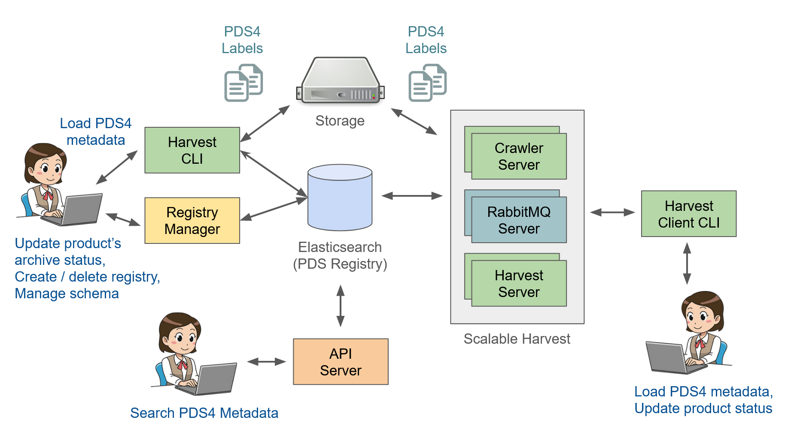

==================
About PDS Registry
==================

PDS Registry provides functionality for tracking, searching, auditing, locating, and maintaining artifacts within the system. 
These artifacts can range from data files and label files, schemas, dictionary definitions for objects and elements, services, etc. 
The core functionality for this component is satisfied by `Elasticsearch <https://www.elastic.co/>`_.

The high level architecture of PDS Registry and its main components is shown below.

Elasticsearch
*************

`Elasticsearch <https://www.elastic.co/>`_ is a NoSQL database based on Apache Lucene project, 
optimized for text search. All metadata extracted from PDS4 labels is storted in Elasticsearch database.

Harvest
*******

Harvest is a software to crawl and extract metadata from PDS4 labels and to load 
extracted information into Elasticsearch. There are two versions of Harvest:

 * Standalone command-line tool.
 * Scalable Harvest.

**Standalone Harvest**

A command-line tool which doesn't require complex installation and configuration. 
The standalone Harvest can run on a laptop.
This tool is recommended for small data sets of up to 5,000-10,000 of PDS4 labels.

**Scalable Harvest**

This product consists of several server components: RabbitMQ message broker, Crawler server, and Harvest server, 
which can be deployed in the cloud or on-prem. Also there is a Harvest Client command-line tool to submit jobs
to server components asynchronously.
This setup is recommended if you want to process big data sets in parallel.

Registry Manager
****************

A command-line tool to perform admin tasks on a Registry, such as:

 * Create or delete registry indices in Elasticsearch.
 * Manage registry data dictionary.
 * Update product archive status.

API
***

Provides read-only REST APIs to search and access PDS data. You can call REST APIs directly or
use Python or Java clients.  More information about PDS API clients is available
`here <https://nasa-pds.github.io/pds-api-client/>`_.

