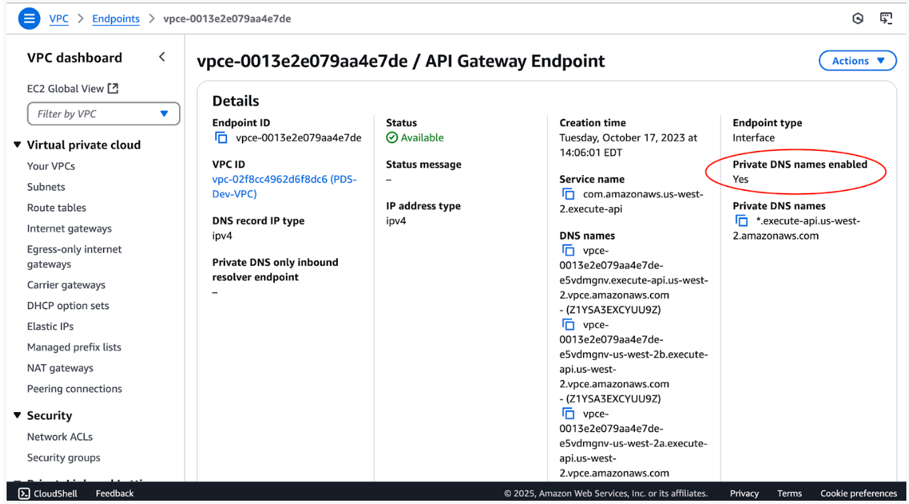

============================================
Connection Setup
============================================

Overview
********

This page provides the steps necessary to get going with data ingestion and
querying of the PDS Registry Service on the cloud from the perspective of a Discipline
Node (DN).

Initial Set-up
**************

To get things going, you should have provided the Engineering Node contact with the following:

  * A list of user email addresses which will be authorized to perform data ingestion.
  * A list of IP addresses or blocks of addresses from which data ingestion will occur.

The IP addresses are added to an access whitelist.

Opensearch accounts will be set up for each user and their username and (temporary)
password will be sent to them.

Along with your Opensearch user credentials you will receive configuration inputs for your tools to connect to the registry services.

The following sections provide the steps to follow to have your connection set up.

Changing Your Opensearch Password
*********************************

To update your user password click `here <https://pds-prod-nucleus-dum.auth.us-west-2.amazoncognito.com/login?client_id=3rgdgts818hdrkas4q66lebum0&response_type=code&scope=email+openid&redirect_uri=https%3A%2F%2Fnasa-pds.github.io%2Fdata-upload-manager%2F>`_ and select "Forgot your password".

Registry Tools Configurations
******************************

Have a Secure Directory For Your Configurations
~~~~~~~~~~~~~~~~~~~~~~~~~~~~~~~~~~~~~~~~~~~~~~~~

Create a secure directory to place config files: Two of the config files you will be creating should be placed in a secure location accessible only by the current user.

On **Linux** and Linux-like Operating Systems:

Create new ``$HOME/.auth directory``

Change access to this directory to be only current user accessible only:

.. code:: bash

    chmod 700 $HOME/.auth

On **Windows**:

Take the necessary precautions so that the directory is not readable by anyone but its owner.

Authentication file
~~~~~~~~~~~~~~~~~~~~

Create Harvest authentication file
Create a ``registry-auth.txt`` file with your username and password, and place it in the secure location created above.

.. code:: javascript

    user = {username sent by Engineering Node}
    password = {your password}

Registry Client Environment
~~~~~~~~~~~~~~~~~~~~~~~~~~~~

Create Registry Client environment variables file (registry-client.env):

Engineering Node (pds-operator@jpl.nasa.gov) will provide you with a config file containing necessary Registry OpenSearch configuration information.

On **Linux** and Linux-like Operating Systems:

Update this file with your username and password.

As needed, update the setting of the environment variables to match the shell you are using.

Place in the secure location created above.

On **Windows**:

The environment variables noted will need to be set manually through the Windows console.

OpenSearch Connection Configuration File, For Harvest and Registry Manager
~~~~~~~~~~~~~~~~~~~~~~~~~~~~~~~~~~~~~~~~~~~~~~~~~~~~~~~~~~~~~~~~~~~~~~~~~~~

Create OpenSearch connection configuration file, e.g.  sbn_mcp_prod.xml or sbn_mcp_test.xml.

.. note::
    Engineering Node (pds-operator@jpl.nasa.gov) will provide you with the content of the file.

Run Registry Tools on AWS
~~~~~~~~~~~~~~~~~~~~~~~~~

You can run harvest on AWS, on ECS or EC2 directly.

Run Harvest On EC2
-------------------

You can run Harvest on EC2, as anywhere else, using the Cognito authentication and configurations described above.

However, to be able to access the PDS Registry which is also hosted on AWS, on a different AWS account, you must disable “Private DNS names” in the VPC endpoint of the API gateway, otherwise the PDS Registry API gateway requests will be redirected to your own account and fail.

See the AWS console screenshot, you should have **No** instead of **Yes** here:

If you need to change that in your AWS account, double check that all your other applications still work.

Run Harest On ECS
-------------------

You can run harvest on ECS, as on EC2 using the Cognito authentication.

Alternatively if you run harvest, on ECS, on the same AWS account as the Registry service, you can also configure the connexion to the Registry without Cognito authentication, as follows:

.. code:: xml

   <?xml version="1.0" encoding="UTF-8"?>
   <registry_connection index="en-registry">
     <ec2_credential_url endpoint="https://<abcdefg>.us-west-2.aoss.amazonaws.com">http://169.254.170.2/AWS_CONTAINER_CREDENTIALS_RELATIVE_URI</ec2_credential_url>
   </registry_connection>

vThe ECS task role must give you access to the Registry Opensearch Serverless Collection.

Next steps
~~~~~~~~~~~

Once the above setup is complete, the Registry Tools are used to process and ingest product
metadata into the Registry. Details on how to install and run these tools are found in:

- :doc:`Install </install/install>`
- :doc:`User Tasks </user/tasks>`
