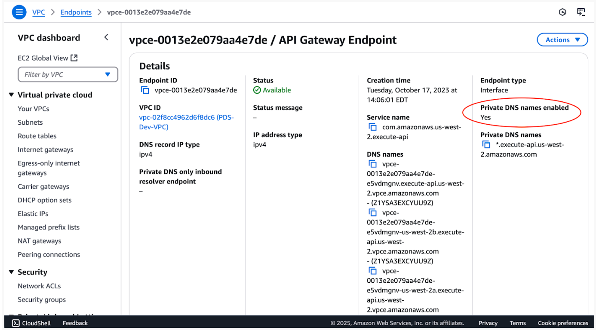

============================================
Connection Setup
============================================

Overview
********

Steps to connect a Discipline Node (DN) to the PDS Registry Service for data ingestion and querying.

Prerequisites
*************

Before starting, contact the Engineering Node (pds-operator@jpl.nasa.gov) and provide:

1. A list of user email addresses that need data ingestion access.
2. A list of IP addresses or CIDR blocks from which ingestion will occur.

The Engineering Node will:

- Add your IPs to the access whitelist.
- Create OpenSearch accounts and send each user their username and temporary password.
- Send configuration inputs for connecting your tools to the registry.

Change Your OpenSearch Password
********************************

1. Go to the `OpenSearch password reset page <https://pds-prod-nucleus-dum.auth.us-west-2.amazoncognito.com/login?client_id=3rgdgts818hdrkas4q66lebum0&response_type=code&scope=email+openid&redirect_uri=https%3A%2F%2Fnasa-pds.github.io%2Fnucleus%2F>`_.
2. Select **Forgot your password** and follow the prompts.

Registry Tools Configuration
*****************************

Create a Secure Configuration Directory
~~~~~~~~~~~~~~~~~~~~~~~~~~~~~~~~~~~~~~~~~

Config files containing credentials must be stored in a directory accessible only by the current user.

**Linux / macOS:**

1. Create the directory:

   .. code:: bash

       mkdir -p $HOME/.pds

2. Restrict access to the current user only:

   .. code:: bash

       chmod 700 $HOME/.pds

**Windows:**

1. Create the ``%USERPROFILE%\.pds`` directory.
2. Set folder permissions so only your user account has read/write access.

Create the Authentication File
~~~~~~~~~~~~~~~~~~~~~~~~~~~~~~~~

Name the file to include the venue (``dev``, ``test``, or ``prod``) so credentials for each environment are kept separate, e.g. ``registry-auth-prod.txt``.

1. Create ``$HOME/.pds/registry-auth-{venue}.txt`` with the credentials provided by the Engineering Node:

   .. code:: text

       user = {username sent by Engineering Node}
       password = {your password}

2. Restrict the file to the current user:

   .. code:: bash

       chmod 600 $HOME/.pds/registry-auth-{venue}.txt

Create the Registry Client Environment File
~~~~~~~~~~~~~~~~~~~~~~~~~~~~~~~~~~~~~~~~~~~~~

The Engineering Node will provide a ``registry-client.env`` file with OpenSearch connection settings. Rename it to include the venue (e.g. ``registry-client-prod.env``) before placing it in ``$HOME/.pds/``.

**Linux / macOS:**

1. Open the provided ``registry-client-{venue}.env`` file.
2. Update the ``user`` and ``password`` fields with your credentials.
3. Adjust the environment variable export syntax if needed for your shell (``bash``, ``zsh``, etc.).
4. Place the file in ``$HOME/.pds/``.

**Windows:**

1. Open the provided ``registry-client-{venue}.env`` file.
2. Set each variable listed in the file as a Windows environment variable via **System Properties → Environment Variables**.

Create the OpenSearch Connection Configuration File
~~~~~~~~~~~~~~~~~~~~~~~~~~~~~~~~~~~~~~~~~~~~~~~~~~~~~

The Engineering Node will send you this file, already named using the pattern ``registry-config-{node}-{venue}.xml`` (e.g. ``registry-config-sbn-dev.xml``, ``registry-config-sbn-test.xml``, ``registry-config-sbn-prod.xml``).

1. Place the file in ``$HOME/.pds/``.

.. note::
    Contact pds-operator@jpl.nasa.gov if you have not received this file.

Next Steps
~~~~~~~~~~

Once setup is complete, proceed to:

- :doc:`Install </install/install>`
- :doc:`User Tasks </user/tasks>`

.. note::
   If you are running Harvest on AWS EC2 or ECS, see :ref:`connection-setup:Additional Setup for AWS` before proceeding.

Additional Setup for AWS
************************

Run Harvest on EC2
~~~~~~~~~~~~~~~~~~

Harvest on EC2 uses the same Cognito authentication and config files described above.

If your EC2 instance is on a **different AWS account** than the PDS Registry, you must disable **Private DNS names** on the VPC endpoint for the API gateway. Without this change, API gateway requests are redirected to your own account and will fail.

1. In the AWS Console, open the VPC endpoint for the API gateway.
2. Set **Enable private DNS names** to **No**.

3. Verify that your other applications still function after this change.

Run Harvest on ECS
~~~~~~~~~~~~~~~~~~

**Option A — Cognito authentication (cross-account or external):**

Use the same Cognito authentication and config files described above.

**Option B — IAM role authentication (same AWS account as the Registry):**

1. Configure the connection file as follows, replacing the endpoint with the one provided by the Engineering Node:

   .. code:: xml

      <?xml version="1.0" encoding="UTF-8"?>
      <registry_connection index="en-registry">
        <ec2_credential_url endpoint="https://<abcdefg>.us-west-2.aoss.amazonaws.com">http://169.254.170.2/AWS_CONTAINER_CREDENTIALS_RELATIVE_URI</ec2_credential_url>
      </registry_connection>

2. Ensure the ECS task role has access to the Registry OpenSearch Serverless Collection.
