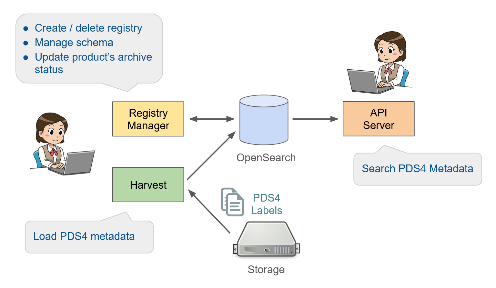

.. note::
   For Data Users, see `PDS API Client User Guide and Documentation here <a href="https://nasa-pds.github.io/pds-api-client/>`_.

PDS Registry
============

PDS Registry provides functionality for tracking, searching, auditing, locating, and maintaining artifacts within the system. 
These artifacts can range from data files and label files, schemas, dictionary definitions for objects and elements, services, etc. 
The core functionality for this component is satisfied by `OpenSearch <https://opensearch.org/>`_.

The high level architecture of PDS Registry and its main components is shown below.

Sitemap
=======

.. toctree::
   :maxdepth: 2

   about
   user/tasks
   admin/tasks
   install/install
   cloud/cloud
   support/support
