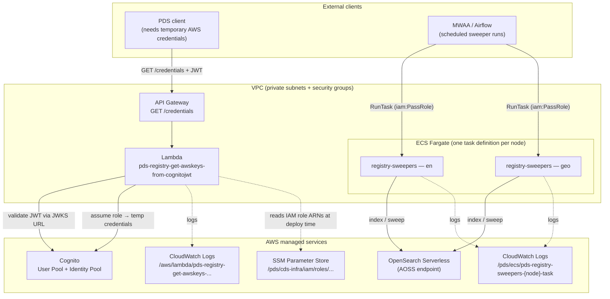

# PDS Registry — Applications

Deploys the application-layer infrastructure: credentials API (API Gateway + Lambda) and registry-sweepers (ECS Fargate).

## Technical architecture

<!-- BEGIN_TF_DOCS -->
<!-- END_TF_DOCS -->
