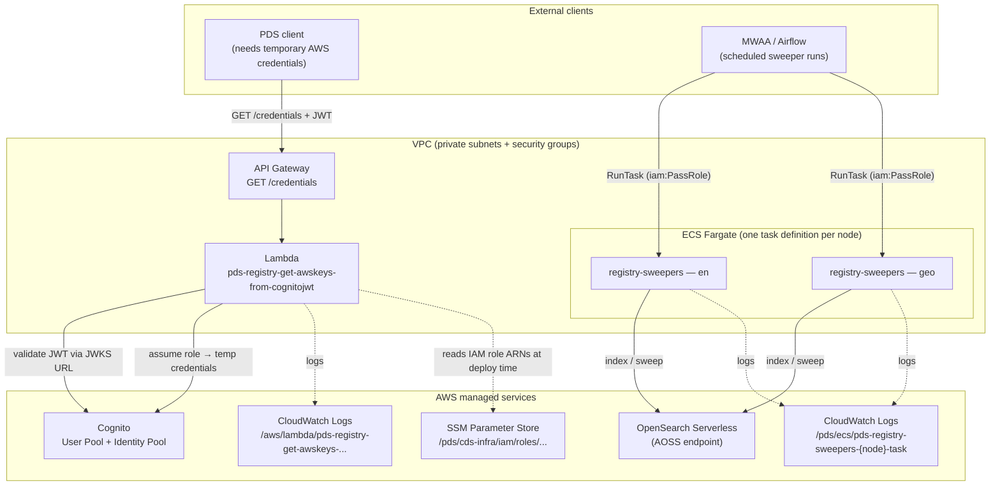

# PDS Registry — Applications

Deploys the application-layer infrastructure: credentials API (API Gateway + Lambda) and registry-sweepers (ECS Fargate).

## Technical architecture

```mermaid
flowchart TB
    subgraph clients["External clients"]
        PDS["PDS client\n(needs temporary AWS credentials)"]
        MWAA["MWAA / Airflow\n(scheduled sweeper runs)"]
    end

    subgraph vpc["VPC (private subnets + security groups)"]
        APIGW["API Gateway\nGET /credentials"]
        Lambda["Lambda\npds-registry-get-awskeys-from-cognitojwt"]
        subgraph fargate["ECS Fargate (one task definition per node)"]
            SweeperEN["registry-sweepers — en"]
            SweeperGEO["registry-sweepers — geo"]
        end
    end

    subgraph aws_managed["AWS managed services"]
        Cognito["Cognito\nUser Pool + Identity Pool"]
        AOSS["OpenSearch Serverless\n(AOSS endpoint)"]
        CW_Lambda["CloudWatch Logs\n/aws/lambda/pds-registry-get-awskeys-..."]
        CW_ECS["CloudWatch Logs\n/pds/ecs/pds-registry-sweepers-{node}-task"]
        SSM["SSM Parameter Store\n/pds/cds-infra/iam/roles/..."]
    end

    PDS -->|"GET /credentials + JWT"| APIGW
    APIGW --> Lambda
    Lambda -->|"validate JWT via JWKS URL"| Cognito
    Lambda -->|"assume role → temp credentials"| Cognito
    Lambda -.->|"logs"| CW_Lambda
    Lambda -.->|"reads IAM role ARNs at deploy time"| SSM

    MWAA -->|"RunTask (iam:PassRole)"| SweeperEN
    MWAA -->|"RunTask (iam:PassRole)"| SweeperGEO
    SweeperEN -->|"index / sweep"| AOSS
    SweeperGEO -->|"index / sweep"| AOSS
    SweeperEN -.->|"logs"| CW_ECS
    SweeperGEO -.->|"logs"| CW_ECS
```

<!-- BEGIN_TF_DOCS -->
## Requirements

| Name | Version |
| ---- | ------- |
|  [terraform](#requirement\_terraform) | >= 1.0 |
|  [aws](#requirement\_aws) | ~> 6.32.1 |

## Providers

No providers.

## Modules

| Name | Source | Version |
| ---- | ------ | ------- |
|  [credentials\_api](#module\_credentials\_api) | ./credentials_api | n/a |
|  [registry\_sweepers](#module\_registry\_sweepers) | git::https://github.com/NASA-PDS/registry-sweepers.git//terraform | develop |

## Resources

No resources.

## Inputs

| Name | Description | Type | Default | Required |
| ---- | ----------- | ---- | ------- | :------: |
|  [aoss\_endpoint](#input\_aoss\_endpoint) | Registry AOSS endpoint URL | `string` | n/a | yes |
|  [managedby](#input\_managedby) | Person or system responsible for the deployment | `string` | n/a | yes |
|  [sweepers\_image\_uri](#input\_sweepers\_image\_uri) | registry-sweepers Docker image URI | `string` | n/a | yes |
|  [sweepers\_nodes](#input\_sweepers\_nodes) | Map of node IDs to ECS resource allocations for registry-sweepers | <pre>map(object({     cpu             = number     memory          = number     additional_args = optional(string)   }))</pre> | n/a | yes |
|  [venue](#input\_venue) | Deployment venue (e.g. pds-en-dev, prod), used in resource tags across all modules | `string` | n/a | yes |
|  [acm\_certificate\_arn](#input\_acm\_certificate\_arn) | ACM Certificate ARN used for HTTPS access to the Registry API load balancer, re-use the certificate of the cloudfront distribution DNS | `string` | `""` | no |
|  [admin\_roles](#input\_admin\_roles) | List of AWS principals (ARNs) allowed to access the OpenSearch collection with admin permissions. | `list(string)` | `[]` | no |
|  [api\_gateway\_name](#input\_api\_gateway\_name) | Name of the API Gateway | `string` | `"pds-registry-api"` | no |
|  [api\_gateway\_stage\_name](#input\_api\_gateway\_stage\_name) | API Gateway deployment stage name | `string` | `"prod"` | no |
|  [aws\_profile](#input\_aws\_profile) | AWS profile to use for authentication | `string` | `""` | no |
|  [aws\_region](#input\_aws\_region) | AWS region for resources | `string` | `"us-east-1"` | no |
|  [aws\_s3\_bucket\_logs\_id](#input\_aws\_s3\_bucket\_logs\_id) | ID of the S3 bucket used for registry-api load balancer access logs | `string` | `""` | no |
|  [cognito\_allowed\_groups](#input\_cognito\_allowed\_groups) | List of Cognito groups allowed to access the Lambda function | `list(string)` | `[]` | no |
|  [cognito\_identity\_pool\_id](#input\_cognito\_identity\_pool\_id) | Cognito Identity Pool ID for Lambda authentication | `string` | `""` | no |
|  [cognito\_user\_pool\_id](#input\_cognito\_user\_pool\_id) | Cognito User Pool ID for Lambda authentication | `string` | `""` | no |
|  [collection\_name](#input\_collection\_name) | Name of the OpenSearch Serverless collection | `string` | `"registry-collection"` | no |
|  [environment](#input\_environment) | Environment name (dev, staging, prod) | `string` | `"dev"` | no |
|  [lambda\_memory\_size](#input\_lambda\_memory\_size) | Lambda function memory size in MB | `number` | `512` | no |
|  [lambda\_runtime](#input\_lambda\_runtime) | Lambda runtime version | `string` | `"python3.13"` | no |
|  [lambda\_timeout](#input\_lambda\_timeout) | Lambda function timeout in seconds | `number` | `30` | no |
|  [mwaa\_execution\_role\_name](#input\_mwaa\_execution\_role\_name) | Name of the MWAA execution role that needs iam:PassRole to launch ECS tasks | `string` | `""` | no |
|  [node\_list](#input\_node\_list) | List of discipline nodes (e.g., ['geo', 'atm', 'img']). For each node, a read-write access rule will be created for the pattern '{node}-*' with the principal 'arn:aws:iam::{account\_id}:role/pds-registry-{node}-read-write-aoss-role' | `list(string)` | `[]` | no |
|  [node\_nucleus\_harvest\_iam\_roles](#input\_node\_nucleus\_harvest\_iam\_roles) | Map of discipline node names to their IAM role ARNs (e.g., { geo = 'arn:aws:iam::...' }). Keys should match entries in node\_list. | `map(string)` | `{}` | no |
|  [public\_subnet\_ids](#input\_public\_subnet\_ids) | Subnet IDs for the registry API load balancer | `list(string)` | `[]` | no |
|  [readonly\_roles](#input\_readonly\_roles) | List of AWS principals (ARNs) allowed to access the OpenSearch collection with readonly permissions. | `list(string)` | `[]` | no |
|  [registry\_api\_docker\_image](#input\_registry\_api\_docker\_image) | Docker image URI for the registry-api ECS service | `string` | `""` | no |
|  [registry\_api\_ecs\_service\_security\_group](#input\_registry\_api\_ecs\_service\_security\_group) | Security group associated ot the ECS Service | `string` | `""` | no |
|  [security\_group\_ids](#input\_security\_group\_ids) | Security group IDs for the VPC endpoint (if not provided, a default security group will be created) | `list(string)` | `[]` | no |
|  [standby\_replicas](#input\_standby\_replicas) | Enable standby replicas for the collection (ENABLED or DISABLED) | `string` | `"DISABLED"` | no |
|  [subnet\_ids](#input\_subnet\_ids) | Subnet IDs for the VPC endpoint (required if create\_vpc\_endpoint is true) and for the Registry API ECS Service | `list(string)` | `[]` | no |
|  [vpc\_id](#input\_vpc\_id) | VPC ID where the OpenSearch Serverless VPC endpoint will be created (required if create\_vpc\_endpoint is true) | `string` | `""` | no |

## Outputs

| Name | Description |
| ---- | ----------- |
|  [api\_gateway\_endpoint](#output\_api\_gateway\_endpoint) | Base URL of the API Gateway |
|  [api\_gateway\_id](#output\_api\_gateway\_id) | ID of the API Gateway |
|  [cognito\_jwks\_url](#output\_cognito\_jwks\_url) | Cognito JWKS URL used for JWT token validation |
|  [credentials\_endpoint](#output\_credentials\_endpoint) | Full URL for the GET /credentials endpoint |
|  [lambda\_function\_arn](#output\_lambda\_function\_arn) | ARN of the Lambda function |
|  [lambda\_function\_name](#output\_lambda\_function\_name) | Name of the Lambda function |
|  [lambda\_log\_group\_arn](#output\_lambda\_log\_group\_arn) | ARN of the Lambda CloudWatch Log Group |
|  [lambda\_log\_group\_name](#output\_lambda\_log\_group\_name) | Name of the Lambda CloudWatch Log Group |
|  [node\_list](#output\_node\_list) | List of discipline nodes |
|  [sweepers\_log\_group\_names](#output\_sweepers\_log\_group\_names) | Map of node name to CloudWatch log group name |
|  [sweepers\_task\_definition\_arns](#output\_sweepers\_task\_definition\_arns) | Map of node name to ECS task definition ARN |
|  [sweepers\_task\_role\_arn](#output\_sweepers\_task\_role\_arn) | Sweeper task role ARN needed to update the OpenSearch data access policy |
<!-- END_TF_DOCS -->
